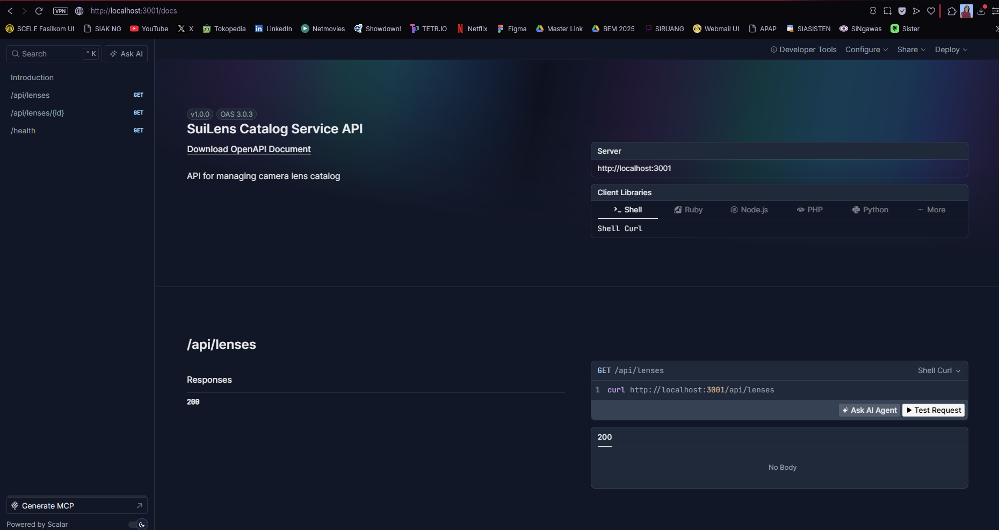
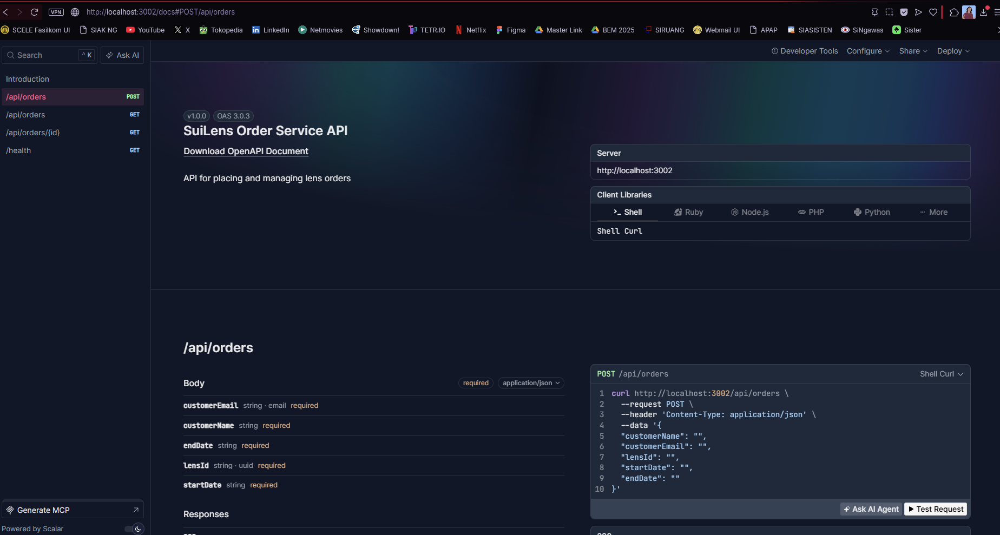
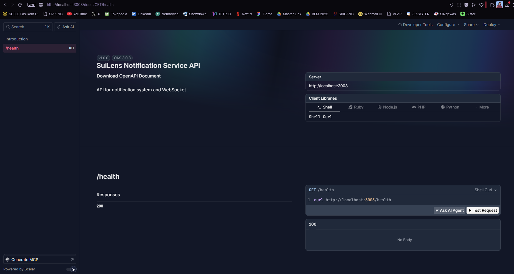
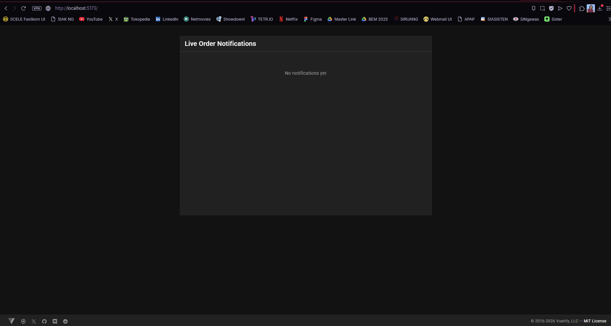
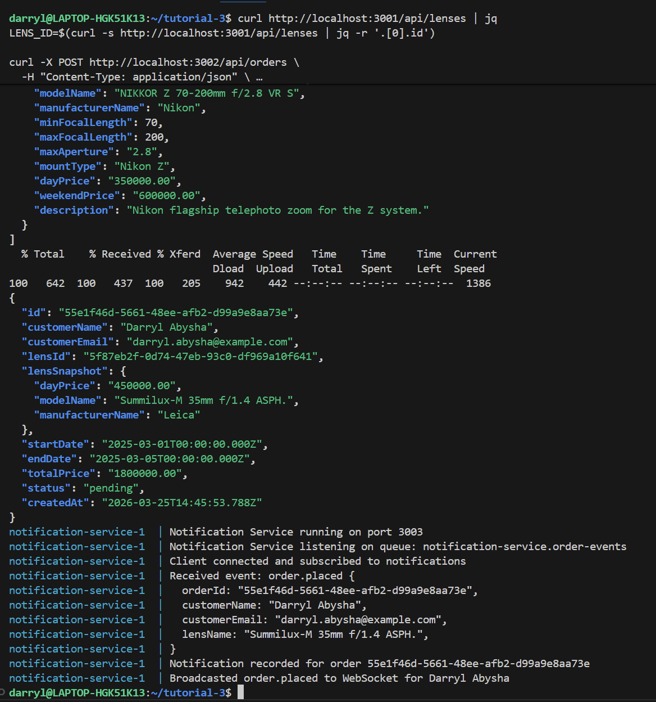
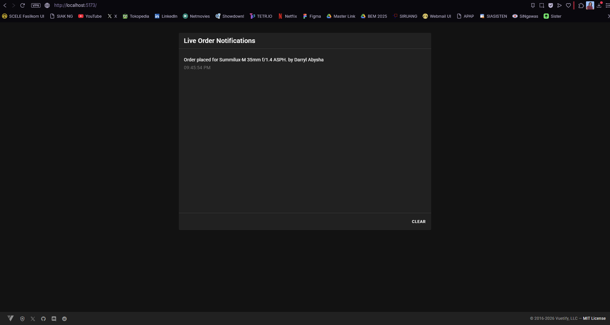
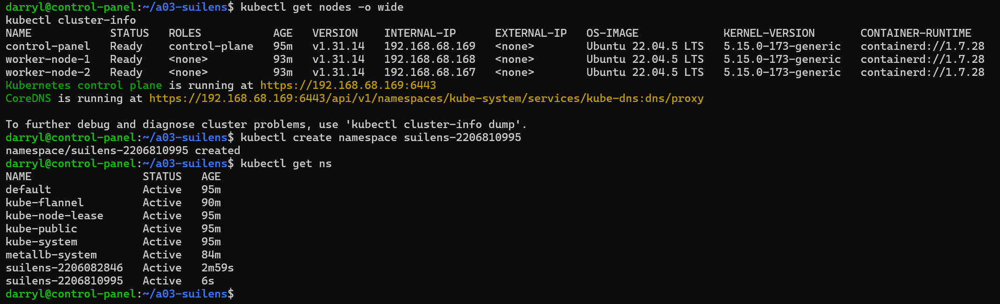

# ⚡ Tugas 3 - On Premise (SuiLens)

**Mata Kuliah:** CSCE604271 — Arsitektur Aplikasi Web  
**Nama:** Darryl Abysha Artapradana Subiyanto  
**NPM:** 2206082846  

---

# Bagian 1: SETUP - suilens-microservice-tutorial

Microservices tutorial implementation for Assignment 1 Part 2.2.

## Run

```bash
docker compose up --build -d
```

## Migrate + Seed (from host)

```bash
(cd services/catalog-service && bun install --frozen-lockfile && bunx drizzle-kit push)
(cd services/order-service && bun install --frozen-lockfile && bunx drizzle-kit push)
(cd services/notification-service && bun install --frozen-lockfile && bunx drizzle-kit push)
(cd services/catalog-service && bun run src/db/seed.ts)
```

## Smoke Test

```bash
curl http://localhost:3001/api/lenses | jq
LENS_ID=$(curl -s http://localhost:3001/api/lenses | jq -r '.[0].id')

curl -X POST http://localhost:3002/api/orders \
  -H "Content-Type: application/json" \
  -d '{
    "customerName": "Budi Santoso",
    "customerEmail": "budi@example.com",
    "lensId": "'"$LENS_ID"'",
    "startDate": "2025-03-01",
    "endDate": "2025-03-05"
  }' | jq

docker compose logs notification-service --tail 20
```

## Stop

```bash
docker compose down
```

---

# Bagian 2: Implementasi OpenAPI

Berikut adalah dokumentasi OpenAPI (Swagger) untuk masing-masing *service* yang telah diimplementasikan:

- **Catalog Service:**
  GET /api/lenses, GET /api/lenses/:id, GET /health
  


- **Order Service:**
  POST /api/orders, GET /api/orders, GET /api/orders/:id, GET /health
  

- **Notification Service:**
  GET /api/notifications, GET /health
  

---

## Bagian 3: Implementasi WebSocket & Smoke Test

Fitur WebSocket telah diimplementasikan sehingga notifikasi pesanan baru dapat langsung muncul pada *frontend* secara *real-time* tanpa perlu memuat ulang halaman.

Berikut adalah hasil eksekusi *smoke test* menggunakan data pribadi:

**1. Kondisi Frontend Sebelum POST Data:**


**2. Eksekusi POST Data (Smoke Test):**

```bash
curl http://localhost:3001/api/lenses | jq
LENS_ID=$(curl -s http://localhost:3001/api/lenses | jq -r '.[0].id')

curl -X POST http://localhost:3002/api/orders \
  -H "Content-Type: application/json" \
  -d '{
    "customerName": "Darryl Abysha",
    "customerEmail": "darryl.abysha@example.com",
    "lensId": "'"$LENS_ID"'",
    "startDate": "2025-03-01",
    "endDate": "2025-03-05"
  }' | jq

docker compose logs notification-service --tail 20
```


**3. Kondisi Frontend Setelah POST Data (Notifikasi WebSocket Berhasil):**


---

## Bagian 4: Deployment Kubernetes
**1. Setup Repository pada VM:**
 

**2. Deploy Aplikasi:**